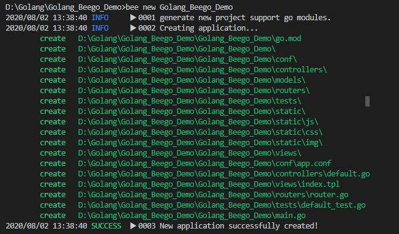

# Golang_Beego
學習之後，製作成筆記，方便日後使用時復習
<left class="half">
    
</left>

# 下載GO安裝包
[GoLang](https://golang.org/dl/)

# 測試
```shell
go version
```
- 

```shell
go env
```
- 

# 安裝VSCode外掛
- 

# 安裝Beego腳手架
[Beego官網](https://beego.me/quickstart)
```shell
go get -u github.com/astaxie/beego
```
- 

```shell
go get -u github.com/beego/bee
```
- 

安裝上若有卡住不動，可參考
[Golang Beego中没法下载第三方包解决办法](http://bbs.itying.com/topic/5ed08edee7c0790f8475e276)
```shell
go env -w GO111MODULE=on
go env -w GOPROXY=https://goproxy.cn,direct
```
- 

輸入bee，確認安裝完成
```shell
bee
```
- 

新建項目
```shell
bee new Golang_Beego_Demo
```
- 

運行項目
```shell
bee run
```
- 
- 

資料夾結構
- 

# 執行畫面示意
- 
- 